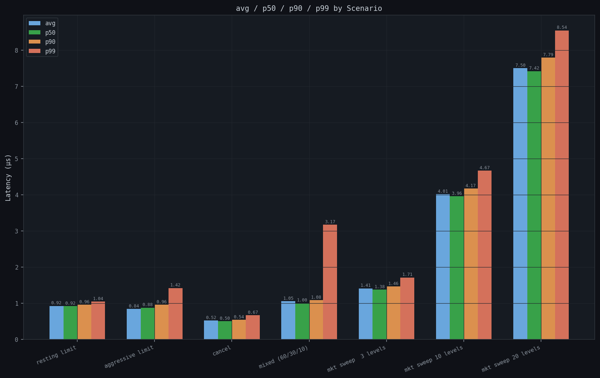
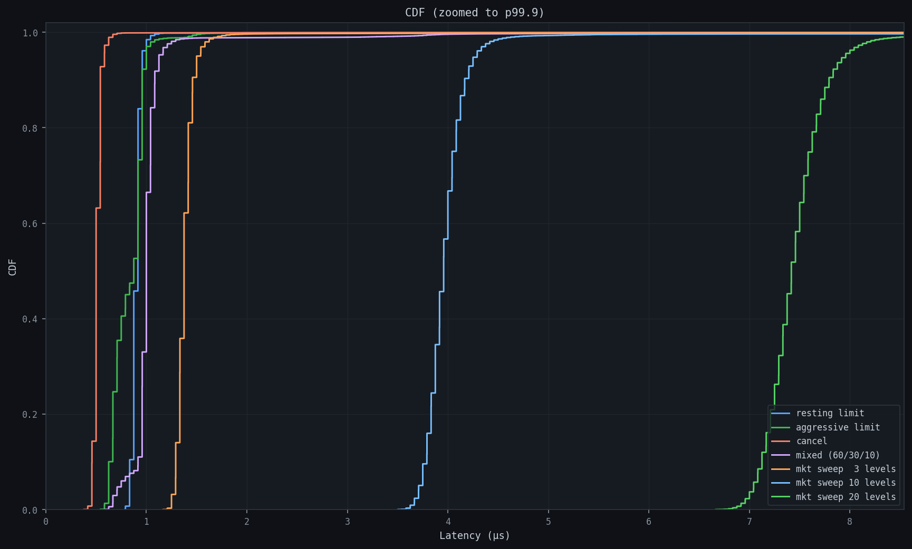
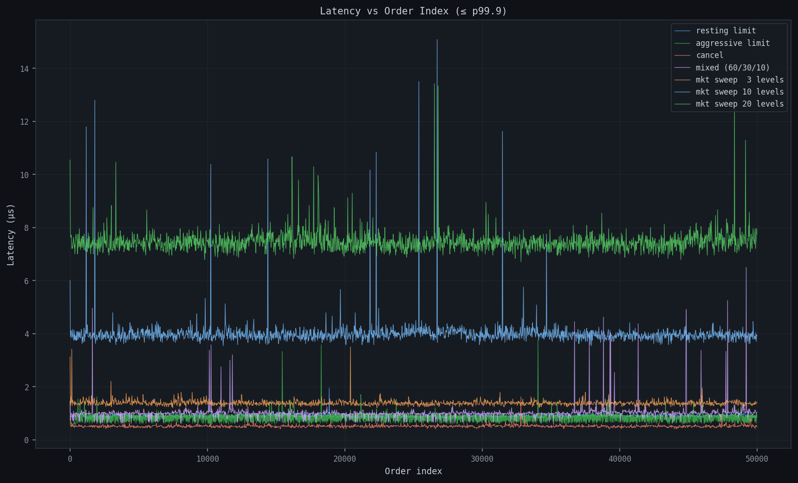
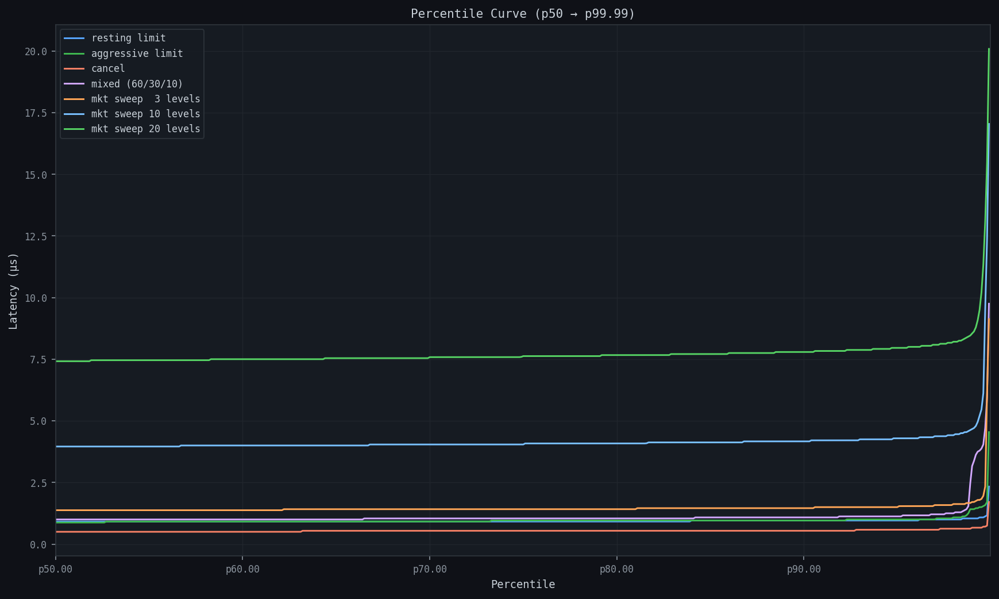
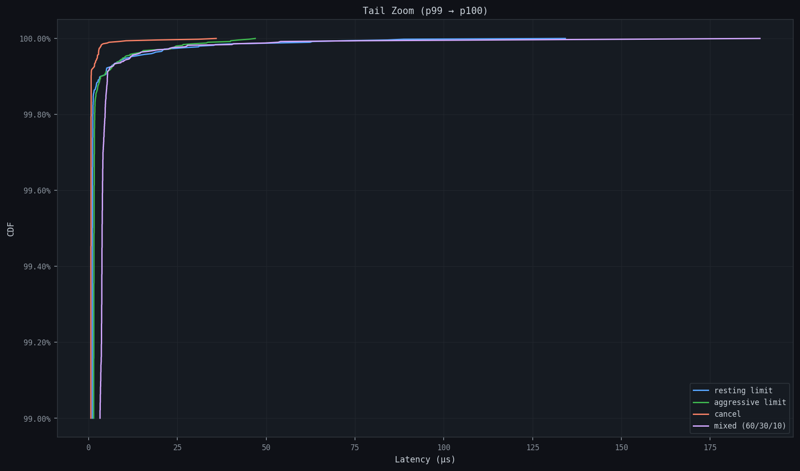
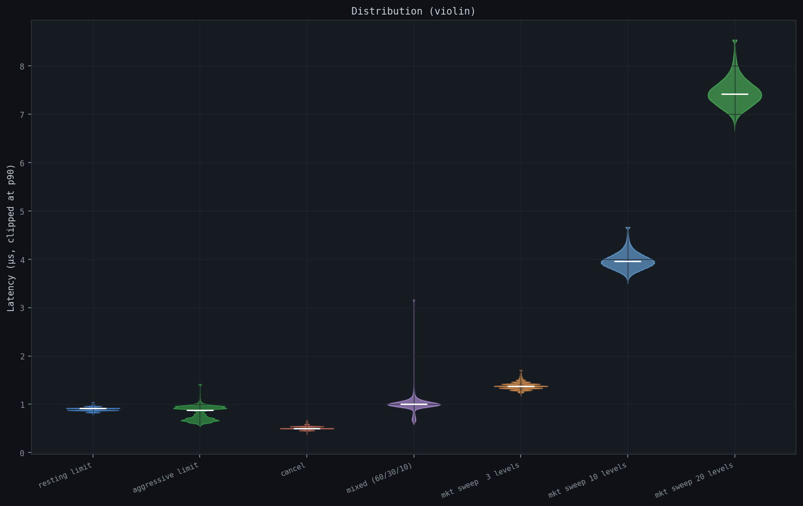
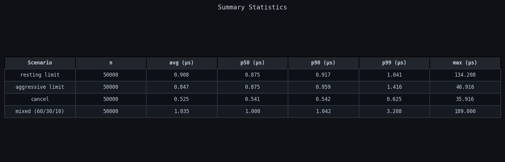

# Limit Order Book & Matching Engine Simulator

[](https://github.com/nikkowalow/order-book-simulator/actions/workflows/build.yml)

A C++ implementation of a **price–time priority** limit order book and matching engine, exposing an HTTP REST API, a real-time WebSocket feed, and a React UI for visualizing order flow, market depth, and executed trades.

This project models the core mechanics of modern electronic exchanges with an emphasis on determinism, correctness, and clean system boundaries.

---

## Table of Contents

- [Overview](#overview)
- [Key Features](#key-features)
- [Architecture](#architecture)
- [Project Structure](#project-structure)
- [Core Types](#core-types)
- [Order Book](#order-book)
- [Matching Engine](#matching-engine)
- [HTTP API](#http-api)
- [WebSocket Server](#websocket-server)
- [Logging & Journaling](#logging--journaling)
- [User Manager](#user-manager)
- [Market Maker & Trading Bots](#market-maker--trading-bots)
- [Concurrency Model](#concurrency-model)
- [Benchmarks](#benchmarks)

---

## Overview

At its core, the system maintains a **limit order book** consisting of resting buy and sell limit orders, organized by price and time. Incoming orders are matched according to standard exchange rules, producing trades that are immediately journaled and exposed to downstream consumers.

The project is intentionally split into clearly defined layers:

- A low-level matching engine written in C++
- An HTTP REST API for order entry and market data queries
- A WebSocket server for real-time streaming of trades and book state
- A React frontend for live visualization

---

## Key Features

- Price–time priority limit order book
- Support for limit and market orders
- Partial fills and multi-trade matching across multiple price levels
- Deterministic matching behavior
- Append-only trade and order event journaling (JSONL)
- HTTP REST API for order entry, cancellation, and market data
- Real-time WebSocket feed for trades and book snapshots
- Per-user position tracking with preflight balance validation
- Optional market maker and four automated trading bot strategies
- PMR pool allocator for low-latency, low-fragmentation order storage

---

## Architecture

The system follows a layered pipeline from client to order book to downstream sinks:


### Data Flow

```
┌──────────────────────────────────────────────────────────────┐
│                        CLIENT LAYER                           │
│         HTTP REST (8080)  │  WebSocket (9001)                 │
└──────────────┬────────────────────┬─────────────────────────-┘
               │                    │
        ┌──────▼──────┐      ┌──────▼──────┐
        │ HTTP        │      │  WsServer   │
        │ Handlers    │      │  (Beast)    │
        └──────┬──────┘      └──────┬──────┘
               │                    │
               └──────────┬─────────┘
                           │  book_mtx (shared lock)
               ┌───────────▼──────────────┐
               │      MatchingEngine      │
               │  process_order()         │
               │  cancel_order()          │
               │  preflight_check()       │
               │  match_buy / match_sell  │
               └──────┬──────────┬────────┘
                      │          │
           ┌──────────▼──┐  ┌────▼────────────┐
           │  OrderBook  │  │  UserManager    │
           │  bids (map) │  │  positions      │
           │  asks (map) │  │  balance check  │
           │  index (ht) │  │  on_fill        │
           │  PMR pool   │  │  on_resting     │
           └──────┬──────┘  └─────────────────┘
                  │
       ┌──────────▼──────────────────┐
       │     MultiTradeSink          │
       │     (fanout to all sinks)   │
       └────────┬────────────────────┘
                │
       ┌────────▼────────┐   ┌────────────────────┐
       │ JournalTrade    │   │  WsServer          │
       │ Sink            │   │  broadcast()       │
       │ → trades.jsonl  │   │  → all WS clients  │
       └─────────────────┘   └────────────────────┘

       ┌─────────────────────────────┐
       │  JournalOrderSink           │
       │  → orders.jsonl             │
       └─────────────────────────────┘
```

### Server Ports

| Port | Protocol  | Purpose                                            |
| ---- | --------- | -------------------------------------------------- |
| 8080 | HTTP      | REST API for order entry, queries, user management |
| 9001 | WebSocket | Real-time trade and book state streaming           |

---

## Project Structure

```
core/
├── src/
│   ├── types/
│   │   └── types.hpp              # Order, Trade, OrderResult, enums
│   ├── book/
│   │   ├── order_book.hpp         # OrderBook class, Locator, PMR pool
│   │   └── order_book.cpp
│   ├── engine/
│   │   ├── matching_engine.hpp    # MatchingEngine class
│   │   ├── matching_engine.cpp
│   │   ├── order_sink.hpp         # OrderSink interface, OrderEvent struct
│   │   └── multi_trade_sink.hpp   # Fanout sink
│   ├── server/
│   │   ├── tcp_server.cpp         # Main server entrypoint, startup wiring
│   │   ├── http_handlers.hpp/cpp  # HTTP route registration, JSON parsing
│   │   ├── ws_server.hpp/cpp      # WebSocket server (Boost.Beast)
│   │   └── book_serializer.hpp/cpp# Book/order snapshot serialization
│   ├── logging/
│   │   ├── journal_trade_sink.hpp/cpp  # Writes trades to JSONL
│   │   └── journal_order_sink.hpp/cpp  # Writes order events to JSONL
│   ├── user/
│   │   ├── user_manager.hpp/cpp   # Position tracking, balance enforcement
│   ├── market_maker/
│   │   ├── market_maker.hpp/cpp   # Automated liquidity maker
│   │   └── trading_bots.hpp/cpp   # Momentum, mean-reversion, noise, sniper
│   ├── sim/
│   │   └── seed_book.hpp/cpp      # Populates book with initial liquidity
│   └── bench/
│       ├── bench.cpp              # Latency benchmark (p50/p90/p99 per scenario)
│       ├── bench_profile.cpp      # Per-subsystem latency breakdown
│       └── bench_plot.py          # Python visualizations from CSV output
├── external/
│   ├── httplib/                   # cpp-httplib (single-header HTTP server)
│   └── tabulate/                  # Table formatting for CLI output
└── CMakeLists.txt
```

---

## Core Types

Defined in `src/types/types.hpp`.

### Enums

```cpp
enum class Side      { Buy, Sell };
enum class OrderType { Limit, Market };
enum class OrderStatus { New, PartiallyFilled, Filled, Canceled, Rejected };
```

### Order

```cpp
struct Order {
    long long  id;        // unique order identifier
    long long  user_id;   // owner (0 = anonymous / system)
    Side       side;      // Buy or Sell
    int        price;     // limit price (0 for market orders)
    long long  qty;       // quantity
    OrderType  type;      // Limit or Market
};
```

### Trade

Produced whenever two orders match.

```cpp
struct Trade {
    long long  trade_id;
    long long  maker_id;       // resting order ID
    long long  taker_id;       // aggressive order ID
    long long  maker_user_id;
    long long  taker_user_id;
    int        price;          // execution price
    long long  qty;            // filled quantity
    long long  seq;            // global sequence number
    std::chrono::nanoseconds timestamp;
};
```

### OrderResult

Returned by `MatchingEngine::process_order()`.

```cpp
struct OrderResult {
    long long          id;
    OrderStatus        status;
    long long          original_qty;
    long long          filled_qty;
    long long          remaining_qty;
    std::vector<Trade> trades;
    std::string        reason;   // populated on rejection
};
```

---

## Order Book

`src/book/order_book.hpp` / `order_book.cpp`

### Data Structures

The order book organizes resting orders into two sorted maps (bids and asks), with a hash index enabling O(1) cancellation by order ID.

```
bids_  std::pmr::map<int, OrderList, std::greater<int>>
       Price → doubly-linked list of Orders (highest price first)

asks_  std::pmr::map<int, OrderList>
       Price → doubly-linked list of Orders (lowest price first)

index_ std::pmr::unordered_map<long long, Locator>
       order_id → { side, price, list::iterator }
       Pre-reserved to 131,072 slots (1 << 17)
```

Each price level holds an `OrderList` — a `std::pmr::list<Order>`. Within a level, orders are stored in arrival order (FIFO), which together with the price-sorted maps implements **price-time priority**.

```
bids_
  102 → [Order A (qty=200)] → [Order B (qty=50)]
  101 → [Order C (qty=150)]
  100 → [Order D (qty=300)] → [Order E (qty=100)]

asks_
  103 → [Order F (qty=180)]
  104 → [Order G (qty=220)]
  105 → [Order H (qty=100)] → [Order I (qty=50)]
```

### Memory Allocation

All containers draw memory from a single `std::pmr::unsynchronized_pool_resource` owned by the `OrderBook` instance. This eliminates per-node `malloc`/`free` calls, reducing fragmentation and keeping allocations in contiguous slabs.

```cpp
class OrderBook {
public:
    using OrderList = std::pmr::list<Order>;

    OrderBook() : bids_(&pool_), asks_(&pool_), index_(&pool_) {
        index_.reserve(1 << 17);
    }

private:
    std::pmr::unsynchronized_pool_resource              pool_;
    std::pmr::map<int, OrderList, std::greater<int>>    bids_;
    std::pmr::map<int, OrderList>                       asks_;
    std::pmr::unordered_map<long long, Locator>         index_;
};
```

### Complexity

| Operation                           | Complexity                             |
| ----------------------------------- | -------------------------------------- |
| `add_resting_order`                 | O(log n) map insert + O(1) list append |
| `cancel_order`                      | O(1) index lookup + O(1) list erase    |
| `best_bid` / `best_ask`             | O(1) map begin()                       |
| `best_bid_queue` / `best_ask_queue` | O(1)                                   |

### Key Methods

```cpp
void          add_resting_order(const Order&);
bool          cancel_order(long long order_id);
std::optional<Order> find_order(long long order_id) const;

std::optional<int>   best_bid() const;
std::optional<int>   best_ask() const;
OrderList*           best_bid_queue();
OrderList*           best_ask_queue();

void  cleanup_best_bid_level_if_empty();
void  cleanup_best_ask_level_if_empty();

long long  bid_depth() const;   // total qty across all bid levels
long long  ask_depth() const;

void  set_on_change(ChangeCallback);  // fires on every book mutation
```

---

## Matching Engine

`src/engine/matching_engine.hpp` / `matching_engine.cpp`

### Responsibilities

The matching engine is the central coordinator. It receives incoming orders, validates them, executes the matching loop against the book, updates user positions, and emits events to all registered sinks.

### Construction

```cpp
MatchingEngine engine(
    book,               // OrderBook reference
    &multi_sink,        // TradeSink* (optional)
    &order_sink,        // OrderSink* (optional)
    &user_manager       // UserManager* (optional)
);
```

All sink and manager pointers are optional. With no sinks, the engine operates as a pure in-memory matching core.

### Preflight Validation

Before any order reaches the matching loop, `preflight_check()` validates:

1. `qty > 0`
2. `price > 0` for limit orders
3. Market orders require at least one resting order on the opposing side
4. If `UserManager` is present:
   - **Buy**: available cash `(balance - reserved_balance) >= price * qty`
   - **Sell**: available shares `(shares - reserved_shares) >= qty`

Rejected orders return an `OrderResult` with `status = Rejected` and a `reason` string.

### Matching Algorithm

`process_order()` follows this sequence:

```
1. Assign order ID and batch ID (atomic increments)
2. Emit NEW order event via order_sink
3. Run preflight_check — return Rejected on failure
4. Determine taker direction (Buy → match against asks, Sell → match against bids)
5. Matching loop (match_buy / match_sell):
   a. Get best opposing price level
   b. Compare to taker limit price (skip if no crossing)
   c. Iterate FIFO queue at that level
   d. For each maker:
      - fill_qty = min(taker.qty, maker.qty)
      - Create Trade record
      - Update UserManager (on_fill)
      - Reduce maker.qty by fill_qty
      - Reduce taker.qty by fill_qty
      - If maker fully filled: pop from queue, remove from index
   e. Cleanup empty price level
   f. Continue until taker filled or no more crossable prices
6. If taker is a Limit order with remaining qty:
   - add_resting_order(taker) into book
   - Notify UserManager (on_order_resting) — reserves balance/shares
   - Emit RESTING event
7. Emit FILLED / PARTIAL_FILL event
8. Notify book change callback (triggers WS broadcast)
9. Return OrderResult
```

**Price-time priority** is enforced by:

- Sorted maps (best price always at `begin()`)
- FIFO lists within each level (oldest order matched first)

### Batch Timestamp

A single `steady_clock::now()` call is captured before the trade loop and stamped on all trades in the batch. This avoids N clock reads for an N-level sweep and ensures all trades from one taker order share the same timestamp.

### Atomics

```cpp
std::atomic<long long> next_id_{1000};    // order IDs
std::atomic<long long> event_seq_{1};     // order event sequence
std::atomic<long long> batch_seq_{1};     // batch correlation ID
```

Global trade sequence and trade IDs are file-scope atomics shared across all engine instances.

---

## HTTP API

`src/server/http_handlers.cpp` — served on **port 8080** via `cpp-httplib`.

All responses are JSON. All routes set CORS headers (`Access-Control-Allow-Origin: *`).

### Order Entry

#### `POST /order`

Place a new order.

**Request body:**

```json
{
  "side": "BUY",
  "type": "LIMIT",
  "price": 100,
  "qty": 50,
  "user_id": 1
}
```

- `type` defaults to `"LIMIT"` if omitted
- `price` is ignored for market orders
- `user_id` is optional; if present, balance is checked and position is updated

**Response:**

```json
{
  "id": 1042,
  "status": "FILLED",
  "original_qty": 50,
  "filled_qty": 50,
  "remaining_qty": 0,
  "trades": [
    {
      "trade_id": 7,
      "maker": 1001,
      "taker": 1042,
      "price": 100,
      "qty": 50,
      "seq": 14,
      "ts": 1700000000000000000
    }
  ]
}
```

`status` is one of: `NEW`, `PARTIALLY_FILLED`, `FILLED`, `CANCELED`, `REJECTED`.

#### `POST /cancel`

Cancel a resting order.

**Request body:**

```json
{ "id": 1042 }
```

**Response:** `{ "ok": true }` or `{ "ok": false }` (not found).

Returns `403` if `user_id` is provided but does not match the order owner.

---

### Market Data

#### `GET /book`

Returns the current order book snapshot up to 20 levels deep.

**Response:**

```json
{
  "type": "book_snapshot",
  "payload": {
    "bids": [
      { "price": 99, "qty": 450, "orders": [200, 150, 100] },
      { "price": 98, "qty": 300, "orders": [300] }
    ],
    "asks": [
      { "price": 101, "qty": 500, "orders": [250, 250] },
      { "price": 102, "qty": 200, "orders": [200] }
    ]
  }
}
```

#### `GET /orders`

Returns all resting orders in the book (flat list).

**Response:**

```json
{
  "type": "orders_update",
  "payload": [
    { "id": 1001, "user_id": 0, "side": "bid", "price": 99, "qty": 200 },
    { "id": 1002, "user_id": 0, "side": "ask", "price": 101, "qty": 250 }
  ]
}
```

#### `GET /trades?limit=N`

Returns the last N trade records from `trades.jsonl`. Default 100, max 1000.

**Response:** JSON array of trade objects (newest first).

#### `GET /activity?limit=N`

Returns the last N order lifecycle events from `orders.jsonl`. Default 100, max 1000.

---

### User Endpoints

#### `POST /user/connect`

Allocates a new user and returns their ID.

**Response:** `{ "userId": 3 }`

#### `GET /user/position?user_id=N`

Returns the position snapshot for a user.

**Response:**

```json
{
  "user_id": 3,
  "balance": 98500,
  "reserved_balance": 1500,
  "shares": 105,
  "reserved_shares": 0,
  "net_qty": 5,
  "total_buy_qty": 10,
  "total_sell_qty": 5,
  "total_buy_value": 1000,
  "total_sell_value": 500
}
```

#### `GET /user/orders?user_id=N`

Returns all resting orders in the book owned by the given user.

#### `GET /user/trades?user_id=N&limit=M`

Returns trades involving the given user (as maker or taker), filtered from `trades.jsonl`.

#### `GET /users`

Returns a list of all registered user IDs.

---

### Market Maker Control

#### `POST /market_maker/toggle`

Starts or stops the market maker. Returns `{ "running": true/false }`.

#### `GET /market_maker/status`

Returns `{ "running": true/false }`.

---

### Health

#### `GET /health`

Returns `ok` (text/plain). Used for load balancer / deployment health checks.

---

## WebSocket Server

`src/server/ws_server.hpp` / `ws_server.cpp` — served on **port 9001** using **Boost.Beast** and **Boost.Asio**.

### Connection Lifecycle

```
Client connects to ws://host:9001/?userId=N
         │
         ▼
HTTP upgrade (Beast reads request headers)
         │
Extract optional userId query param (for reconnect)
         │
         ▼
WebSocket handshake
         │
user_manager.reconnect_user(uid)
         │
         ▼
Server sends → {"type":"session","userId":N,"reconnected":bool}
Server sends → book snapshot   (serialize_book_json)
Server sends → orders snapshot (serialize_orders_json)
         │
         ▼
Bidirectional message loop (per-client thread)
```

### Incoming Messages (Client → Server)

The WebSocket server accepts order and cancel actions over the socket, identical in semantics to the HTTP endpoints.

**Place an order:**

```json
{
  "action": "order",
  "side": "BUY",
  "type": "LIMIT",
  "price": 100,
  "qty": 50,
  "requestId": "abc123"
}
```

**Cancel an order:**

```json
{
  "action": "cancel",
  "id": 1042,
  "requestId": "xyz789"
}
```

The `requestId` field is optional. If present, it is echoed back in the response to allow the client to correlate responses with requests.

### Outgoing Messages (Server → Client)

**Trade event** — broadcast to all connected clients whenever a trade executes:

```json
{
  "type": "trade",
  "seq": 14,
  "trade_id": 7,
  "price": 100,
  "qty": 50,
  "maker": 1001,
  "taker": 1042,
  "maker_user": 0,
  "taker_user": 3,
  "ts": 1700000000000000000
}
```

**Book snapshot** — broadcast to all clients on every book mutation (any add/cancel/fill):

```json
{
  "type": "book_snapshot",
  "payload": {
    "bids": [{ "price": 99, "qty": 450, "orders": [200, 150, 100] }],
    "asks": [{ "price": 101, "qty": 500, "orders": [250, 250] }]
  }
}
```

**Orders update** — broadcast alongside book snapshot:

```json
{
  "type": "orders_update",
  "payload": [
    { "id": 1001, "user_id": 0, "side": "bid", "price": 99, "qty": 200 }
  ]
}
```

**Session message** — sent once on connect:

```json
{ "type": "session", "userId": 3, "reconnected": false }
```

### Reconnection

A client can reconnect and recover their prior session by passing their `userId` as a query parameter:

```
ws://host:9001/?userId=3
```

The server calls `user_manager.reconnect_user(3)`, which reuses the existing position record. The session message will include `"reconnected": true`.

### Concurrency

Each client runs on its own thread. A shared `clients_mtx_` protects the client list during broadcast. Each client also has an individual `write_mtx` to prevent interleaved writes from concurrent broadcasts and direct responses.

---

## Logging & Journaling

All events are written to append-only JSON Lines (`.jsonl`) files. Each line is one complete JSON object.

### Trade Journal (`trades.jsonl`)

Written by `JournalTradeSink` on every fill.

```json
{
  "seq": 14,
  "trade_id": 7,
  "price": 100,
  "qty": 50,
  "maker": 1001,
  "taker": 1042,
  "maker_user": 0,
  "taker_user": 3,
  "ts": 1700000000000000000
}
```

### Order Event Journal (`orders.jsonl`)

Written by `JournalOrderSink` at each lifecycle transition: NEW → RESTING / PARTIAL_FILL / FILLED / CANCELLED / REJECTED.

```json
{
  "seq": 22,
  "batch_id": 8,
  "order_id": 1042,
  "user_id": 3,
  "type": "FILLED",
  "side": "BUY",
  "price": 100,
  "qty": 50,
  "remaining_qty": 0,
  "ts": 1700000000000000000
}
```

The `batch_id` groups all events produced by a single `process_order()` call (NEW + any number of PARTIAL_FILL + FILLED/RESTING), enabling full reconstruction of any order's lifecycle.

### Fanout Pattern

`MultiTradeSink` implements `TradeSink` and fans out to a list of registered sinks. In the running server, both the trade journal and the WebSocket server are registered:

```cpp
MultiTradeSink multi_sink;
multi_sink.add_sink(&journal_trade_sink);
multi_sink.add_sink(&ws_server);
```

This decouples the engine from any specific downstream consumer.

---

## User Manager

`src/user/user_manager.hpp` / `user_manager.cpp`

### Position Model

Each user holds a `Position` struct:

| Field              | Description                                |
| ------------------ | ------------------------------------------ |
| `balance`          | Cash available (default 100,000)           |
| `reserved_balance` | Cash locked in resting BUY limit orders    |
| `shares`           | Shares available (default 100)             |
| `reserved_shares`  | Shares locked in resting SELL limit orders |
| `net_qty`          | Cumulative net share position              |
| `total_buy_qty`    | Lifetime shares purchased                  |
| `total_sell_qty`   | Lifetime shares sold                       |
| `total_buy_value`  | Lifetime cash spent on buys                |
| `total_sell_value` | Lifetime cash received from sells          |

### Balance Lifecycle

```
Order placed (BUY limit, price=100, qty=10):
  reserved_balance += 1000

Order rests → fills (qty=10 at price=100):
  reserved_balance -= 1000
  balance -= 1000
  shares += 10
  net_qty += 10

Order cancelled (resting BUY):
  reserved_balance -= (price * remaining_qty)
```

Sell side mirrors this with `reserved_shares`.

### Preflight Integration

`MatchingEngine::preflight_check()` reads the position before any order enters the matching loop:

- **Buy**: `balance - reserved_balance >= price * qty`
- **Sell**: `shares - reserved_shares >= qty`

Failure returns an `OrderResult` with `status = Rejected`.

### Thread Safety

All `UserManager` methods acquire an internal `std::mutex`. The `on_fill` and `on_order_resting` callbacks are invoked by the matching engine while `book_mtx` is held — the nesting order is always `book_mtx → user_mtx` to prevent deadlock.

---

## Market Maker & Trading Bots

### Market Maker

`src/market_maker/market_maker.cpp`

The market maker provides continuous two-sided liquidity. It runs two threads:

**Maker thread** (350ms interval):

1. Reads best bid and ask
2. Computes mid-price (or falls back to `anchor_px = 100`)
3. Posts a BUY limit at `mid - spread/2` and a SELL limit at `mid + spread/2`
4. Only adds liquidity when current depth is below `target_depth` (2,000 qty per side)

**Taker thread** (350ms interval):

1. Checks bid and ask depth
2. If both sides have at least `min_depth` (1,000):
   - Identifies the heavier side
   - Sends a market order against it to rebalance depth

The market maker can be toggled at runtime via `POST /market_maker/toggle`.

### Trading Bots

`src/market_maker/trading_bots.cpp`

Four independent bot strategies run as background threads:

#### Momentum Bot (200ms)

Maintains a sliding window of the last 8 mid-prices. If the 8-sample momentum exceeds ±2 ticks, it posts a limit order in the direction of the trend.

```
momentum >= +2 → BUY limit at best_ask, qty=10
momentum <= -2 → SELL limit at best_bid, qty=10
```

#### Mean-Reversion Bot (400ms)

Tracks an EMA of mid-price (α=0.08). When the price deviates more than 2.5 ticks from the EMA, it fades the move with a passive limit order.

```
mid > EMA + 2.5 → SELL at EMA+1, qty=15
mid < EMA - 2.5 → BUY at EMA-1, qty=15
```

#### Noise Bot (60–280ms random)

Posts small random limit orders at random prices near the mid (±5 ticks, qty 1–8). Simulates retail flow and keeps the book active.

#### Sniper Bot (150ms)

Monitors the bid-ask spread. When spread ≥ 3 ticks, it places a BUY one tick inside the best ask and a SELL one tick inside the best bid, attempting to earn the spread.

```
spread >= 3:
  BUY at best_ask - 1, qty=20
  SELL at best_bid + 1, qty=20
```

All bot and market maker orders use `user_id = 0`, bypassing preflight balance checks.

---

## Concurrency Model

### Locks

| Lock                     | Scope                                                 | Held by                                                  |
| ------------------------ | ----------------------------------------------------- | -------------------------------------------------------- |
| `book_mtx`               | External mutex protecting `OrderBook` during mutation | HTTP routes, WebSocket handler, MarketMaker, TradingBots |
| `UserManager::mtx_`      | Protects `positions_` and `order_to_user_`            | All UserManager public methods                           |
| `JournalTradeSink::mtx_` | Serializes writes to `trades.jsonl`                   | `on_trade()`                                             |
| `JournalOrderSink::mtx_` | Serializes writes to `orders.jsonl`                   | `on_order_event()`                                       |
| `WsServer::clients_mtx_` | Protects client list during broadcast/removal         | `broadcast()`, `remove_client()`                         |
| `Client::write_mtx`      | Prevents interleaved writes on a single client socket | `broadcast()`, `send_to_client()`                        |

### Atomics

All sequence counters and ID generators are `std::atomic<long long>` with relaxed or sequential consistency:

- `MatchingEngine::next_id_` — order IDs
- `MatchingEngine::event_seq_` — order event sequence numbers
- `MatchingEngine::batch_seq_` — batch correlation IDs
- Global `trade_seq`, `trade_id_counter` — cross-engine trade identifiers
- `UserManager::next_id_` — user IDs (uses `compare_exchange_weak` for reconnect)
- `WsServer::running_`, `MarketMaker::running_` — lifecycle flags

### Threading Model

```
Main thread:        TCP echo server accept loop (legacy)
http_thread:        httplib blocking server (8080)
ws_accept_thread:   Boost acceptor loop (9001)
ws_client_thread:   One per connected WebSocket client (detached)
mm_maker_thread:    MarketMaker maker loop (350ms tick)
mm_taker_thread:    MarketMaker taker loop (350ms tick)
bot_momentum:       Momentum bot (200ms tick)
bot_mean_rev:       Mean-reversion bot (400ms tick)
bot_noise:          Noise bot (60–280ms random)
bot_sniper:         Sniper bot (150ms tick)
```

The `book_mtx` is the single choke point. All threads that touch the `OrderBook` or `MatchingEngine` must acquire it first. The lock is held only for the duration of matching and insertion — no I/O is performed while holding it.

---

## Benchmarks

All benchmarks are run with a 5,000-order warmup pass followed by 50,000 measured orders on a fresh book. Latencies are measured with `std::chrono::steady_clock` at nanosecond resolution and reported in microseconds.

---

### p50 / p90 / p99 Bar Chart


Side-by-side comparison of avg, p50, p90, and p99 for each scenario. Resting limit orders and cancels are the cheapest operations — they touch only the index and a single price level. Multi-level market sweeps are the most expensive, with p99 increasing roughly linearly with the number of levels consumed.

---

### CDF


Cumulative distribution of latency across all scenarios, zoomed to the 99.9th percentile. The steep left edge shows that the overwhelming majority of orders process well under 1 µs. The spread between scenarios reveals how much matching complexity affects the tail.

---

### Latency vs Order Index


Raw latency plotted in the order each sample was recorded — no sorting applied. This is the most honest view of runtime behaviour. A flat trace indicates stable, consistent performance. Vertical spikes correspond to OS scheduler interruptions or memory allocator events. A rising trend would indicate structural degradation as the book grows.

---

### Percentile Curve


Latency at every percentile from p50 to p99. The curve stays flat through the bulk of the distribution and rises sharply only in the extreme tail, confirming that high-latency events are rare and isolated rather than systemic.

---

### Tail Zoom (p99 → p100)


The top 1% of latency samples in detail. Market sweep scenarios occupy the far right as expected — sweeping 20 levels forces the matching loop to iterate through and consume multiple price levels in a single order, making them the most expensive operation in the engine.

---

### Distribution (Violin)


Distribution shape for each scenario clipped at p90 for readability. Narrow violins indicate tight, predictable latency. Wider bodies at the top indicate a heavier tail. The sniper and noise bots in the mixed workload broaden the distribution compared to the pure resting scenario.

---

### Summary Table


Full numeric summary for every scenario: sample count, mean, p50, p90, p99, and max. The max column reflects worst-case OS jitter rather than engine performance — all scenarios share a similar worst-case ceiling regardless of complexity.
