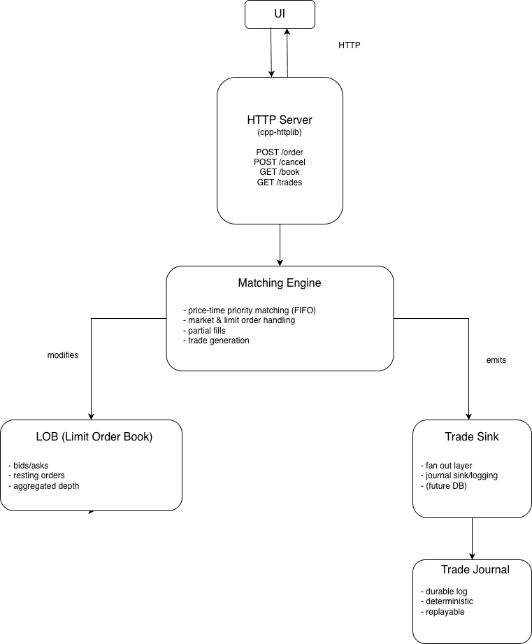

# Limit Order Book & Matching Engine Simulator

Limit Order Book & Matching Engine Simulator
A C++ implementation of a **price–time priority** limit order book and matching engine, exposing an HTTP API and a real-time UI for visualizing order flow, market depth, and executed trades.

This project is designed to model the core mechanics of modern electronic exchanges, with an emphasis on determinism, correctness, and clean system boundaries.

---

## Overview

At its core, the system maintains a **limit order book** consisting of resting buy and sell limit orders, organized by price and time. Incoming orders are matched according to standard exchange rules, producing trades that are immediately journaled and exposed to downstream consumers.

The project is intentionally split into clearly defined layers:

- a low-level matching engine written in C++
- an HTTP API for interaction and market data
- a frontend UI for visualization

---

## Key Features

- Price–time priority limit order book
- Support for both limit and market orders
- Partial fills and multi-trade matching
- Deterministic matching behavior
- Append-only trade journaling (JSONL)
- HTTP API for order entry and market data
- Real-time UI for order book depth and trade history

---

## Architecture

The system follows a simple but realistic pipeline:

